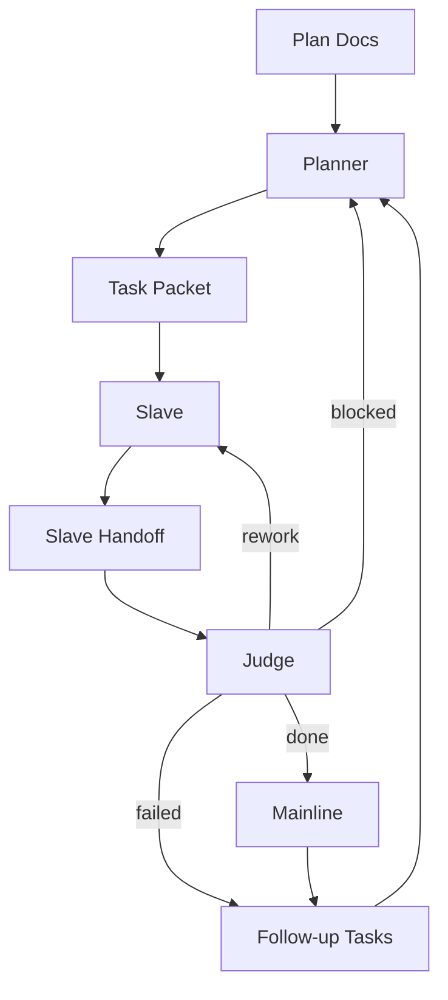

# Clanker Workflow

read_when: planning, operations

## Signals

- `needs_judge`: slave complete
- `rework`: return to same slave
- `blocked`: wait for input
- `failed`: task rejected; planner may split follow-up
